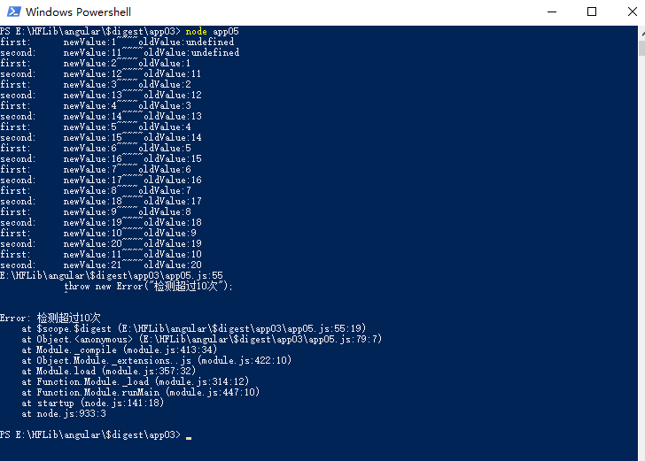

## 组件  
### injector（注入器）  
### provider（提供商）  
它提供一个依赖注入器的配置，create or deliver service  

## 机制  
### 服务注入方式  
#### 依赖注入（Dependancy Injection，简称：DI）  
它是一种设计模式，也是一种编码模式。其中的类会从外部源中请求获取依赖，而不是自己创建它们。注入流程是：injector 通过 provider 来创建 service 的 instance  
### 数据更新机制  
#### 脏数据检查（Dirty checking）  
一次脏检查就是调用一次 $apply() 或者 $digest(),将数据中最新的值呈现在界面上。而每次 UI 事件变更，ajax 还有 timeout 都会触发 $apply()。$digest 函数它执行了所有在作用域上注册过的监听器。遍历所有监听器调用它们的监听函数。它涉及到监听器的listener更改其它监听器的数据是否监听、$digest被执行次数是否考虑边界效应等问题。  
```JAVASCRIPT  
// 运行所有监听器返回布尔值，根据布尔值是否继续执行监听器  
$scope.prototype.$$digestOnce = function() {  
  var dirty;  
  var list = this.$$watchList;  
  for(var i = 0,l = list.length;i<l;i++ ){  
    var watch = list[i];  
    var newValue = watch.getNewValue(this.name);  
    var oldValue = watch.last;  
    if(newValue !==oldValue){  
      watch.listener(newValue,oldValue);  
      // 因为listener操作，已经检查过的数据可能变脏  
      dirty = true;  
    }  
    watch.last = newValue;  
    return dirty;  
  }  
};  
$scope.prototype.$digest = function() {  
  var dirty = true;  
  var checkTimes = 0;  
  while(dirty) {  
    dirty = this.$$digestOnce();  
    checkTimes++;  
    if(checkTimes>10 &&dirty){ //设置最大迭代次数（TTL）：10  
        throw new Error("检测超过10次");  
        console.log("123");  
    }  
  };  
};  
```  
```JAVASCRIPT  
var scope = new $scope();  
scope.first = 1;  
scope.second = 10;  
scope.$watch('first', function(scope) {  
        return scope[this.name]  
    },  
    function(newValue, oldValue) {  
        scope.second++;  
        console.log('first:      newValue:' + newValue + '~~~~' + 'oldValue:' + oldValue);  
    })  

scope.$watch('second', function(scope) {  
        return scope[this.name]  
    },  
    function(newValue, oldValue) {  
        scope.first++;  
        console.log('second:     newValue:' + newValue + '~~~~' + 'oldValue:' + oldValue);  
    })  
scope.$digest();  
```  
  

### 数据绑定方式  
#### 双向绑定  
##### 1. 绑定UI数据  
每一个绑定到 UI 的数据，就会有一个 watch 对象。每当我们将数据绑定到 UI 上，angular 就会向你的 $$watchList 上插入一个 watch 对象，这个对象会被 push 到 $$watchList 中。  
``` HTML  
<!-- 数据绑定到 UI 上 -->  
<span>{{user}}</span>  
<span>{{password}}</span>  
```  
```JAVASCRIPT  
$scope.prototype.$watch = function(name,getNewValue,listener){  
  // watch对象  
  watch = {  
    name:'',  //当前的watch 对象 观测的数据名  
    getNewValue:function($scope){ //得到新值  
      ...  
      return newValue;  
    },  
    listener:function(newValue,oldValue){ // 当数据发生改变时需要执行的操作  
      ...  
    }  
  }  
  this.$$watchList.push(watch);  
}  
```   
##### 2. 界面到数据的更改  
它是由 UI 事件，ajax 请求，或者 timeout 等回调操作  
##### 3. 数据到界面的呈现  
它是由脏检查来做。  

## 开发方式  
### 模块化  
#### 1.设置模块加载器、模块注册  
通过setupModuleLoader(window)函数把一个函数返回给angularModule，并且返回的的函数绑定在window.angular.module上。用于注册模块、获取模块、给模块注册自己的service、controller 、factory、direactive等。
```JAVASCRIPT
function setupModuleLoader(window) {
  var $injectorMinErr = minErr('$injector');
  var ngMinErr = minErr('ng');
  //ensure方法可以看出window.angular这个对象是个单例
  function ensure(obj, name, factory) {
    return obj[name] || (obj[name] = factory());
  }
  var angular = ensure(window, 'angular', Object);
  angular.$$minErr = angular.$$minErr || minErr;
  //其实要给一个对象增加一个方法，在angular中经常使用ensure函数，传一个工厂函数，这样的好处是整齐并且保护作用域
  return ensure(angular, 'module', function() {
    var modules = {};
    return function module(name, requires, configFn) {
      var assertNotHasOwnProperty = function(name, context) {
        if (name === 'hasOwnProperty') {
          throw ngMinErr('badname', 'hasOwnProperty is not a valid {0} name', context);
        }
      };
      assertNotHasOwnProperty(name, 'module');
      if (requires && modules.hasOwnProperty(name)) {
        modules[name] = null;
      }
      return ensure(modules, name, function() {
        if (!requires) {
          throw $injectorMinErr('nomod', "Module '{0}' is not available! You either misspelled " + "the module name or forgot to load it. If registering a module ensure that you " + "specify the dependencies as the second argument.", name);
        }
        var invokeQueue = [];
        var runBlocks = [];
        var config = invokeLater('$injector', 'invoke');
        // 创建一个module实例
        var moduleInstance = {
          _invokeQueue: invokeQueue,
          _runBlocks: runBlocks,
          requires: requires,
          name: name,
          provider: invokeLater('$provide', 'provider'),
          factory: invokeLater('$provide', 'factory'),
          service: invokeLater('$provide', 'service'),
          value: invokeLater('$provide', 'value'),
          constant: invokeLater('$provide', 'constant', 'unshift'),
          animation: invokeLater('$animateProvider', 'register'),
          filter: invokeLater('$filterProvider', 'register'),
          controller: invokeLater('$controllerProvider', 'register'),
          directive: invokeLater('$compileProvider', 'directive'),
          config: config,
          run: function(block) {
            runBlocks.push(block);
            return this;
          }
        };
        if (configFn) {
          config(configFn);
        }
        return moduleInstance;
        function invokeLater(provider, method, insertMethod) {
          return function() {
            invokeQueue[insertMethod || 'push']([provider, method, arguments]);
            return moduleInstance;
          };
        }
      });
    };
  });
}
```
```JAVASCRIPT
angularModule = setupModuleLoader(window)
```
```JAVASCRIPT  
angular.module = module(name, requires, configFn)  
```  