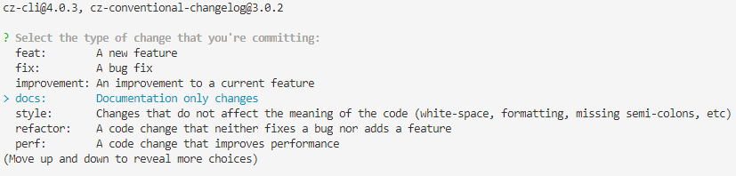
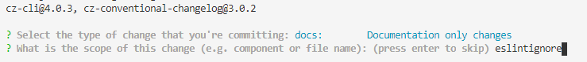
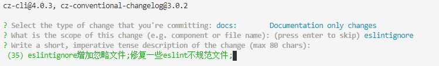
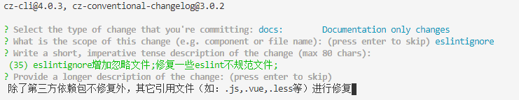
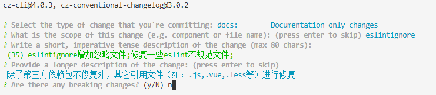
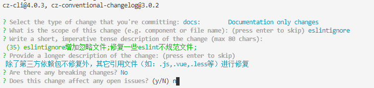
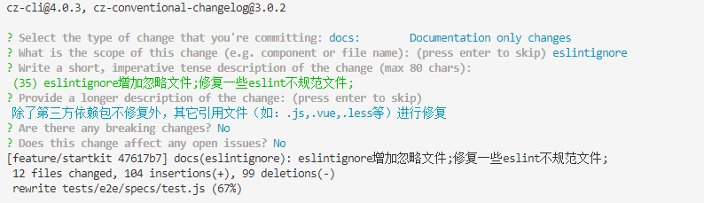

## Git Commit Log规范
参考 Angular 的 Commit message 格式
### 校验插件    
commitizen

### 安装   
npm install -g commitizen   

### 首次使用    
在项目根目录运行以下命令:

  ```
  commitizen init cz-conventional-changelog --save --save-exact
  ```
### 提交代码时    
凡是用到` git commit `命令，一律改为使用 `git cz `就会出现以下交互界面。    
+ **STEP 1： Select the type of change that you're committing**              
      
+ **STEP 2：What is the scope of this change(e.g. component or file name): (press enter to skip)**    
      
+ **STEP 3：Write a short,imperative tense description of the change (max 80 chars)**      
      
+ **STEP 4：Provide a longer description of the change: (press enter to skip)**     
      
+ **STEP 5：Are there any breaking changes? (y/N)**     
      
+ **STEP 6：Does this change effect any open issues? (y/N)**      
      
      