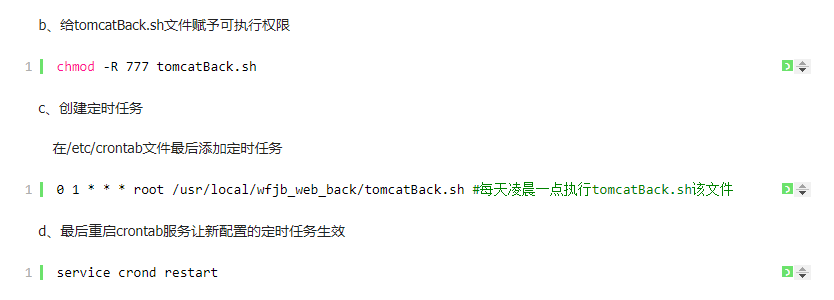

## 基础  
### shell传参  
"$1"，直接拿第一个参数.  
【重要】注：$0,不是第一个参数！而是指：当前脚本的文件名。  
如：sh ./git.sh，则$0为./git.sh。  
https://zhidao.baidu.com/question/714636440747136725.html  
https://www.runoob.com/linux/linux-shell-passing-arguments.html  
传参赋值  
https://segmentfault.com/a/1190000019840727?utm_source=tag-newest  
### 判断  
```  
if [ command ];then  
   符合该条件执行的语句  
elif [ command ];then  
   符合该条件执行的语句  
else  
   符合该条件执行的语句  
fi  
```  
https://blog.csdn.net/zhan570556752/article/details/80399154  
+ 且
-a
https://blog.csdn.net/u010164190/article/details/78973383
+ -eq
数字间的判断
+ ==
字符串间的判断
### 动态变量名
```
let index+=1
val=$(eval echo '$'${index})
echo $val
```
https://blog.csdn.net/agave7/article/details/94429646
### let
let,是 BASH 中用于计算的工具
注：
用于执行一个或多个表达式，变量计算中不需要加上 $ 来表示变量。
运算符间不能有空格，如果表达式中包含了空格或其他特殊字符，则必须引起来。
### 测试过shell命令
```
# 测试
# let index+=1
# echo "$index"
# symbol=$i
# echo $symbol
# echo $i
# let index+=1
# val=$(eval echo '$'${index})
# echo $val
```
### 运算符
https://www.cnblogs.com/good-study/p/11112919.html

## node环境  
### node中执行shell命令  
```  
//使用插件child_process  

var process = require('child_process');  

//清空指定文件夹下文件  
process.exec('rm -fr '+copyUrl+'*',function(err){  
  console.log(err) //当成功是error是null  
})  

//复制指定文件夹下文件到另一个文件下  
process.exec('cp  -r  复制指定文件夹路径（绝对文件夹路径）      粘贴指定文件夹路径（绝对地址）’,function(err){  
     console.log(err) //当成功是error是null  
})  
```  
https://www.jianshu.com/p/a48ac64aa3a7  

## window环境  
### 给这个目录赋予所有人可读可写可执行权限  
```  
chmod  -R 777 /var/www  
```  
这行命令就是给“/var/www”这个目录赋予所有人可读可写可执行权限，4+2+1=7。  

对应的：  
5=4 + 1,表示拥有可读可执行权限，但是没有写权限  
0 代表没有任何权限  

-rw——- (600) 只有所有者才有读和写的权限  
-rw-r–r– (644) 只有所有者才有读和写的权限，组群和其他人只有读的权限  
-rwx—— (700) 只有所有者才有读，写，执行的权限  
-rwxr-xr-x (755) 只有所有者才有读，写，执行的权限，组群和其他人只有读和执行的权限  
-rwx–x–x (711) 只有所有者才有读，写，执行的权限，组群和其他人只有执行的权限  
-rw-rw-rw- (666) 每个人都有读写的权限  

### 把当前目录权限授予yangtao（用户）：  
chown -R yangtao *  
### 开放所有权限：  
chmod -R 777 *  
https://blog.csdn.net/u011808596/article/details/79242271  

## linux环境  
### 自动执行脚本  
  
【重要】  
https://www.jb51.net/article/101569.htm  